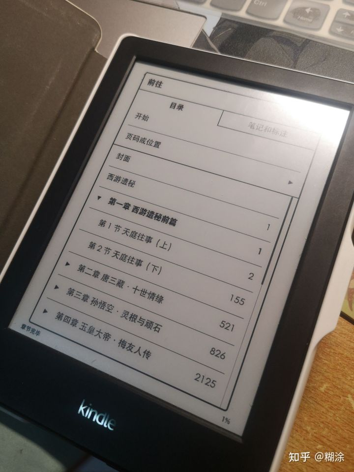

# 知乎 我的书架（严选专栏）爬虫 
注：只支持爬取严选专栏小说，
## 环境
- python3.7
- PyExecJS库
- requests库
- lxml库


- Node.js
- jsdom
> 安装好后jsdom模块默认目录应是 `C:\Users\用户名\AppData\Roaming\npm\node_modules`

## 前期准备
- `my_file`文件夹下
 - 输入jsdom目录即`C:\Users\用户名\AppData\Roaming\npm\node_modules`
 - 输入登陆后知乎cookie

- 小说加入我的书架（注：只支持爬取严选专栏的小说）


## 运行
根文件夹下打开cmd或power shell
### 1、`python main_2.py`


### 2、`python Book.py`


1、执行后程序爬取我的书架所有小说，保存到`小说`文件夹下，已存在以小说名命名的文件夹则跳过
```
小说
│   小说名1.toml（保存小说图片、作者、介绍等信息，转mobi用）
│   
│
└───小说名1
│   │   balabala.txt（每章内容）
│   └───balabala
│   
└───小说名1
│   │   balabala
│   └───balabala
```


2、根目录下生成`.mobi`文件，接下来传到Kindle就好了


## 特别鸣谢
### txt2mobi
感谢zhnxin大佬的txt转mobi程序
> https://github.com/zhnxin/txt2mobi


### 2021年6月知乎指定问题信息爬取 & x-zse-96 2.0版本加密破解分析 爬虫破解反扒思路
感谢锦楠大佬对知乎加密参数破解
> https://blog.csdn.net/qq_26394845/article/details/118183245




